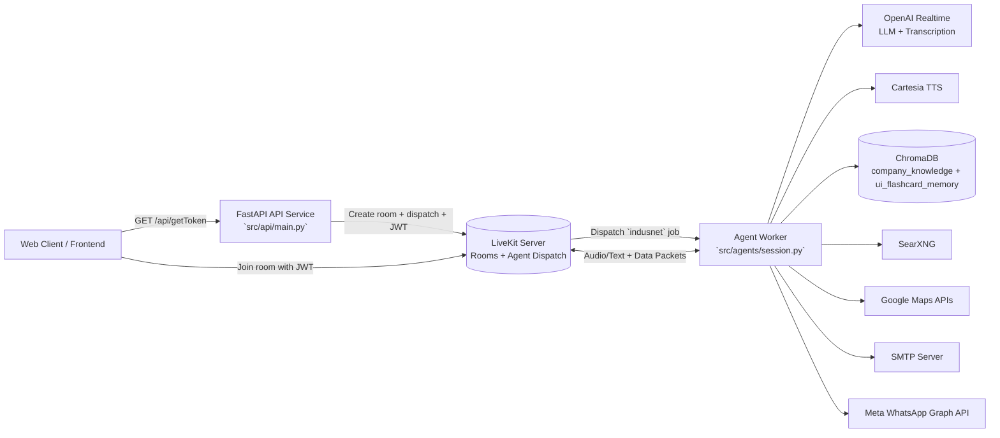
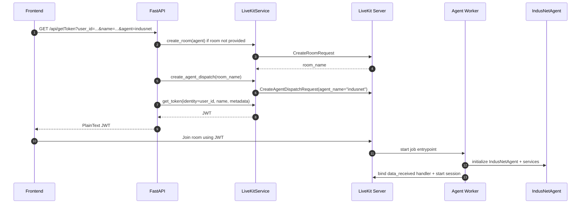
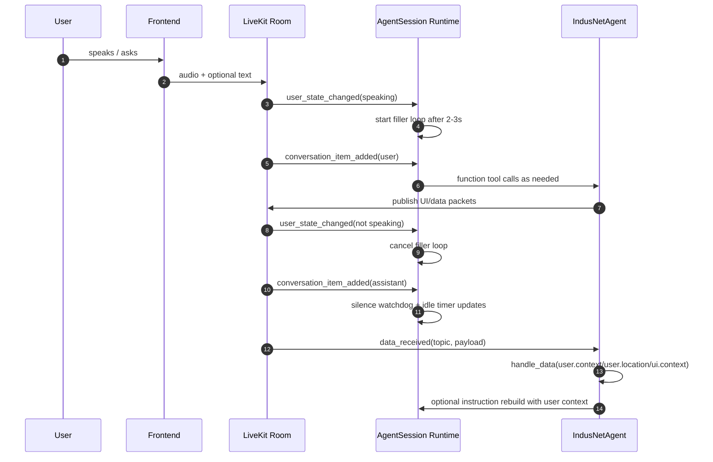

# Architecture

High-level architecture for the `indusnet` voice assistant backend.

## System Context

## Bootstrap Sequence

## Runtime Interaction Loop

## Packet Bus Contracts

### Frontend -> Backend Topics (Agent listens)

| Topic | Purpose | Key payload fields |
|---|---|---|
| `ui.context` | UI context sync (currently update flow is disabled) | `viewport`, `active_elements` |
| `user.context` | User identity sync | `user_info.user_id`, `user_info.user_name`, `user_info.user_email`, `user_info.user_phone` |
| `user.location` | Result of browser geolocation request | `status` (`success/denied/unsupported`), `latitude`, `longitude`, `accuracy`, `error` |

### Backend -> Frontend Topics (Agent publishes)

| Topic | Typical payload `type` |
|---|---|
| `ui.flashcard` | `flashcard`, `end_of_stream` |
| `ui.contact_form` | `contact_form`, `contact_form_submit` |
| `ui.job_application` | `job_application_preview`, `job_application_submit` |
| `ui.meeting_form` | `meeting_form`, `meeting_invite_submit` |
| `ui.location_request` | `location_request`, `map.polyline` |
| `ui.global_presense` | `global_presence` |
| `ui.nearby_offices` | `nearby_offices` |
| `ui.email_delivery` | `context_email_delivery` |
| `ui.whatsapp_delivery` | `context_whatsapp_delivery` |
| `user.details` | user identity echo from `get_user_info` |

## External Interface Notes

- API token endpoint: `GET /api/getToken` returns JWT as plain text.
- Allowed `agent` query value is currently only `indusnet`.
- Runtime architecture is event-driven through LiveKit room events and function tools.
