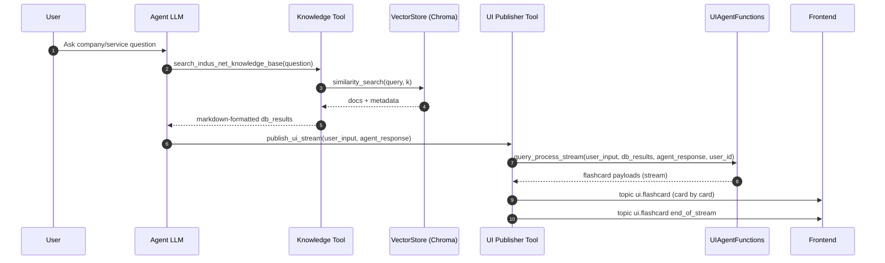
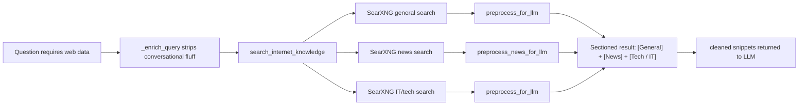
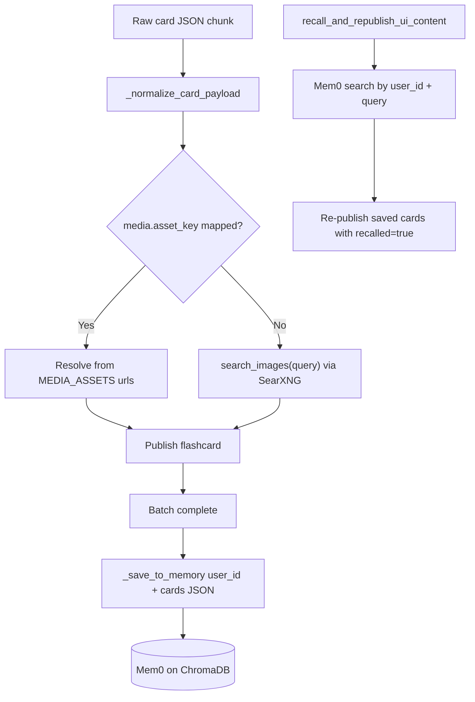
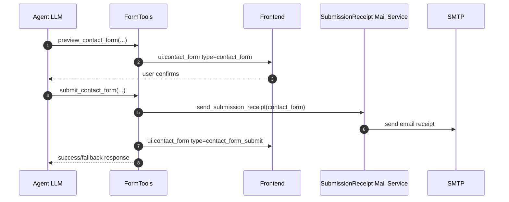
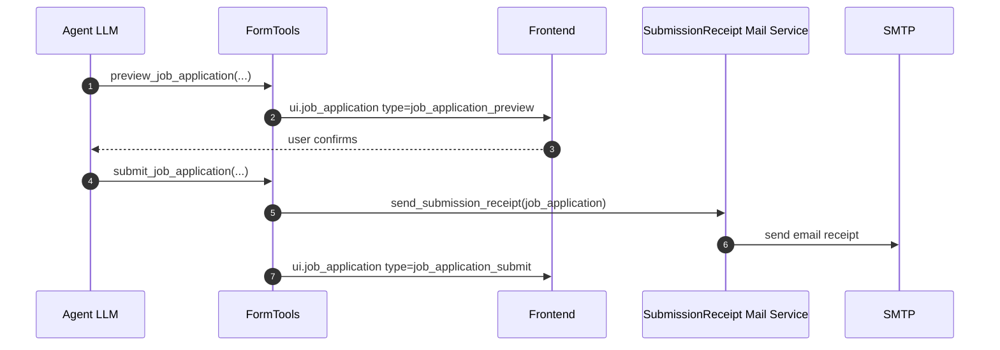
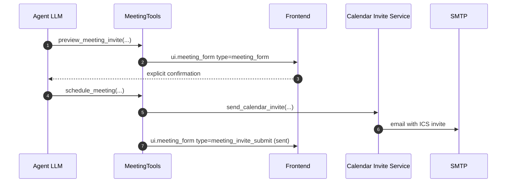
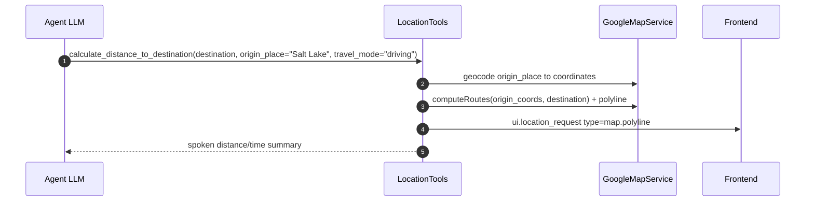
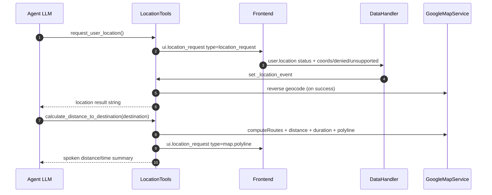
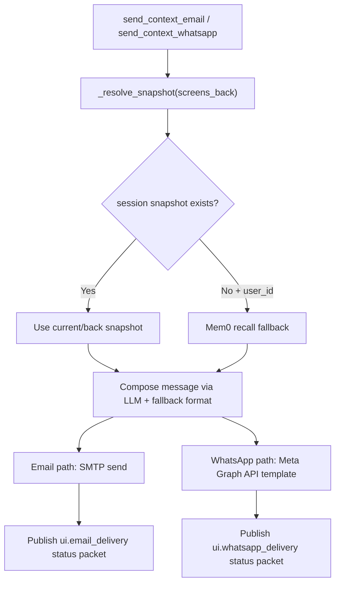
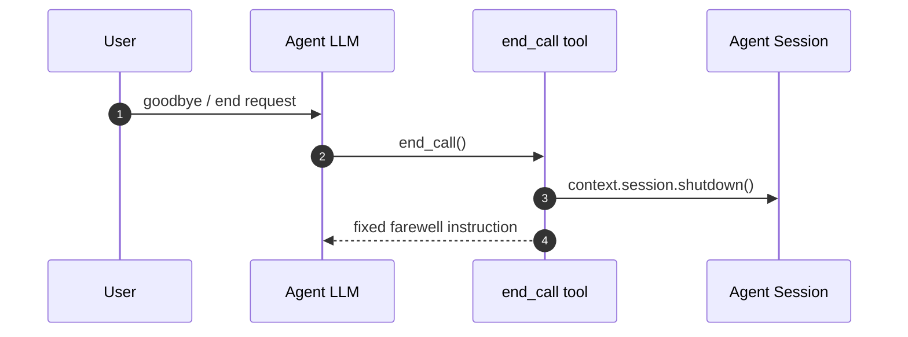

# Data Flows

End-to-end feature flows for the `indusnet` agent.

## 1) Knowledge -> Flashcard Streaming

## 2) Internet Search (Optional branch)

> All three searches run concurrently via `asyncio.gather`. The same enriched query is also used by the image search that drives flashcard visuals on the frontend.

## 3) Flashcard Media + Memory Lifecycle

## 4) Contact Form Flow

## 5) Job Application Flow

## 6) Meeting Invite Flow

## 7) Location + Directions + Polyline

Two paths depending on whether the user provides a place name or asks for GPS.

**Path A — User states a place name (no GPS needed)**

**Path B — User explicitly requests GPS location**

> `request_user_location` is only called when the user explicitly says "use my GPS" or "from my exact location". For all other distance/directions requests the agent asks for a place name and uses Path A.

## 8) Context Sharing (Email + WhatsApp)

## 9) End Call Flow

